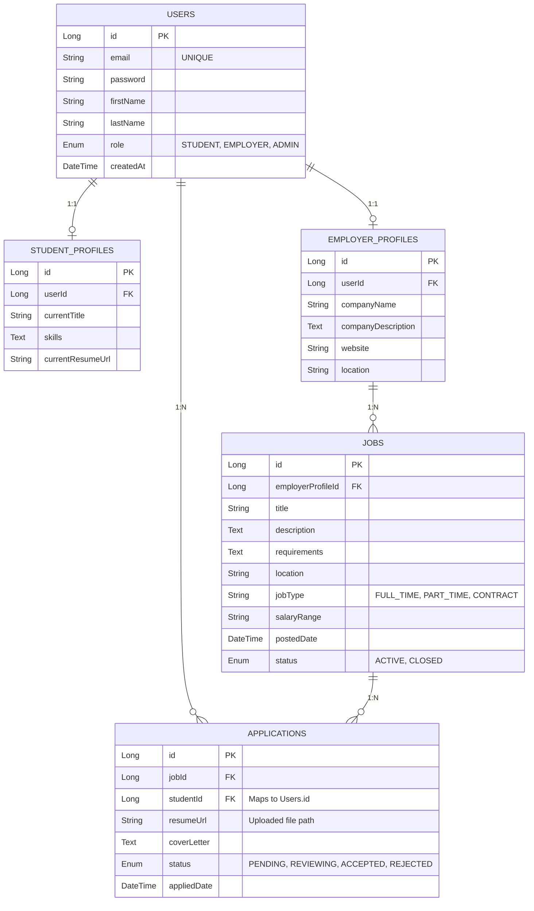

# Job Portal Management System - Implementation Plan

This document outlines the initial architecture, file structure, dependencies, and database schema for the Job Portal Management System as requested. We will review this structure before writing the actual code.

## 1. Project Folder Structure

The project will follow a strict, production-ready layered architecture based on clean code principles.

```text
src/
├── main/
│   ├── java/
│   │   └── com/jobportal/
│   │       ├── JobPortalApplication.java
│   │       ├── config/              # Application, MVC, and File Upload Configurations
│   │       ├── controller/          # Spring MVC Controllers mapping to Thymeleaf Views
│   │       ├── dto/                 # Data Transfer Objects for requests and responses
│   │       │   ├── request/
│   │       │   └── response/
│   │       ├── entity/              # JPA Entities (Database Models)
│   │       │   └── enums/           # Enums (e.g., Role, ApplicationStatus)
│   │       ├── exception/           # Global Exception Handling (@ControllerAdvice)
│   │       ├── repository/          # Spring Data JPA Repositories
│   │       ├── security/            # Spring Security configuration and UserDetailsService
│   │       ├── service/             # Business Logic Interfaces
│   │       │   └── impl/            # Business Logic Implementations
│   │       └── util/                # Utility classes (e.g., FileStorageUtil)
│   └── resources/
│       ├── application.yml          # App properties (Database, Server, File Upload limit)
│       ├── static/                  # Static assets
│       │   ├── css/
│       │   ├── js/
│       │   └── images/
│       └── templates/               # Thymeleaf View HTML files
│           ├── fragments/           # Reusable UI components (header, footer, nav)
│           ├── auth/                # Login, Register pages
│           ├── job/                 # Job listings, details, creation forms
│           ├── application/         # Application tracking pages
│           └── dashboard/           # Student, Employer, and Admin dashboards
└── pom.xml
```

## 2. Dependencies (pom.xml)

The application will use the following core dependencies (managed via Spring Boot Starter Parent):

```xml
<dependencies>
    <!-- Web Development -->
    <dependency>
        <groupId>org.springframework.boot</groupId>
        <artifactId>spring-boot-starter-web</artifactId>
    </dependency>
    
    <!-- View Engine: Thymeleaf -->
    <dependency>
        <groupId>org.springframework.boot</groupId>
        <artifactId>spring-boot-starter-thymeleaf</artifactId>
    </dependency>
    
    <!-- Thymeleaf integration with Spring Security -->
    <dependency>
        <groupId>org.thymeleaf.extras</groupId>
        <artifactId>thymeleaf-extras-springsecurity6</artifactId>
    </dependency>

    <!-- Database: Spring Data JPA -->
    <dependency>
        <groupId>org.springframework.boot</groupId>
        <artifactId>spring-boot-starter-data-jpa</artifactId>
    </dependency>

    <!-- Database Driver: MySQL -->
    <dependency>
        <groupId>com.mysql</groupId>
        <artifactId>mysql-connector-j</artifactId>
        <scope>runtime</scope>
    </dependency>

    <!-- Security: Spring Security -->
    <dependency>
        <groupId>org.springframework.boot</groupId>
        <artifactId>spring-boot-starter-security</artifactId>
    </dependency>

    <!-- Validation: Hibernate Validator -->
    <dependency>
        <groupId>org.springframework.boot</groupId>
        <artifactId>spring-boot-starter-validation</artifactId>
    </dependency>

    <!-- Boilerplate reduction: Lombok -->
    <dependency>
        <groupId>org.projectlombok</groupId>
        <artifactId>lombok</artifactId>
        <optional>true</optional>
    </dependency>

    <!-- Developer Tools -->
    <dependency>
        <groupId>org.springframework.boot</groupId>
        <artifactId>spring-boot-devtools</artifactId>
        <scope>runtime</scope>
        <optional>true</optional>
    </dependency>
    
    <!-- Testing -->
    <dependency>
        <groupId>org.springframework.boot</groupId>
        <artifactId>spring-boot-starter-test</artifactId>
        <scope>test</scope>
    </dependency>
    <dependency>
        <groupId>org.springframework.security</groupId>
        <artifactId>spring-security-test</artifactId>
        <scope>test</scope>
    </dependency>
</dependencies>
```

## 3. Database Schema Design 

Here is the initial normalized database schema outlining the relationships between Users, Profiles, Jobs, and Applications.



### Table Breakdown
1. **`users`**: Core authentication and basic details. Includes role-based access flag.
2. **`student_profiles`**: Extra details for users with the STUDENT role.
3. **`employer_profiles`**: Company details for users with the EMPLOYER role.
4. **`jobs`**: Job postings created by Employers.
5. **`applications`**: The pivot bridging Students and Jobs, tracking the application status and storing the specific resume used for that application.

> [!IMPORTANT]
> **User Review Required**
> Please review the provided folder structure, pom.xml dependencies, and database architecture.
> 
> Open questions:
> 1. Should we include any specific front-end libraries (e.g., Bootstrap, Tailwind, jQuery) or build the UI strictly with raw HTML/CSS/Vanilla JS?
> 2. For the resume upload, would you prefer storing the files locally on the filesystem or simply saving the metadata for now, envisioning a cloud storage like AWS S3 later?

Let me know if you approve of this structure or if you'd like any modifications before we initialize the project and begin writing code!
